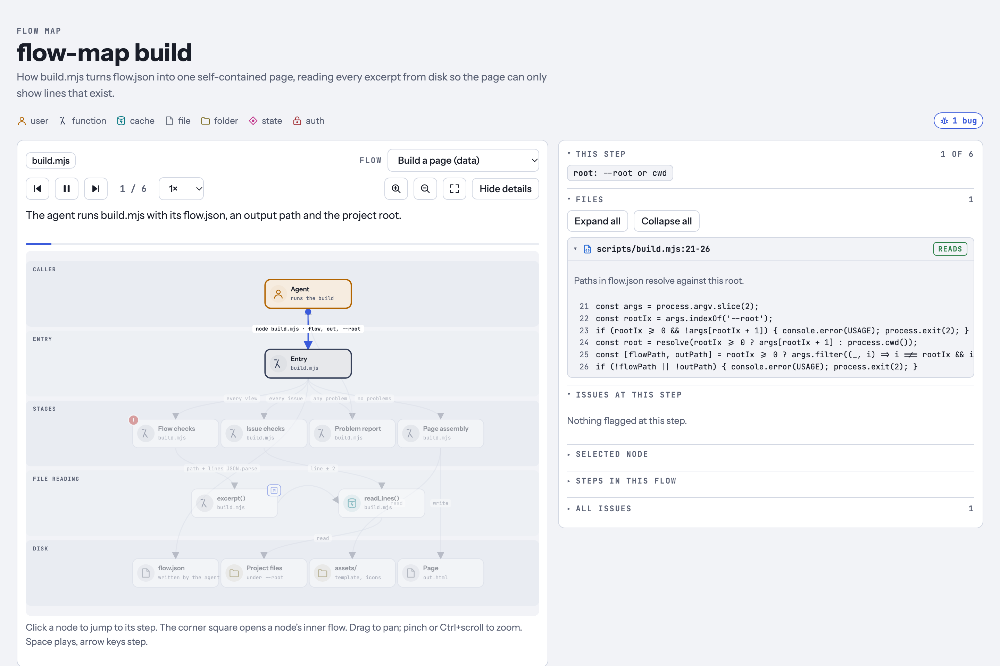

# code-viz

Agent skills that turn code, docs and user journeys into interactive visual maps you can
play, step through and review.



## Skills

| Skill | What it does |
|---|---|
| [`flow-map`](skills/flow-map/SKILL.md) | Traces how an app, feature, pipeline or documented process flows and builds one interactive HTML page: layered components with typed icons, flows you can play, pause, step, zoom and drill into, the real files and line excerpts at every step, state changes, and reviewed issues pinned to the parts they affect. |

## Install

**Claude Code**

```
/plugin marketplace add benjoox/code-viz
/plugin install code-viz@code-viz
```

**Other agents** (Cursor, Codex, Gemini CLI and others, via [skills](https://github.com/vercel-labs/skills))

```bash
npx skills add benjoox/code-viz
```

**Manual**

```bash
git clone https://github.com/benjoox/code-viz
cp -R code-viz/skills/flow-map ~/.claude/skills/
```

## Use

Ask in plain words from the root of the project you want mapped:

- "Map how checkout works in this repo."
- "Walk me through `src/auth/` as a flow map."
- "Review the upload pipeline and pin the issues on the map."

Or call it directly: `/code-viz:flow-map src/api/checkout`.

The agent traces real entry points, writes a `flow.json` model and builds the page. It
reads your code and never edits it.

## How it stays honest

- The agent writes only the model. The build reads every excerpt from disk, so the page
  can only show lines that exist.
- The build rejects unknown ids, missing files, paths outside the project (symlinks
  included), out-of-range lines and excerpts over 40 lines.
- Excerpts are redacted before they reach the page: secret-looking assignments, Bearer and
  Basic credentials, `key=` query values and common API token shapes.
- Issues carry a file, a line, a one-sentence detail and a one-line fix. Anything the
  agent could not verify is marked as a question.

## Requirements

Node.js 18 or later. No dependencies.

## Try the example

The bundled example maps the skill's own build script:

```bash
node skills/flow-map/scripts/build.mjs skills/flow-map/assets/example.flow.json \
  example.html --root skills/flow-map
```

Open `example.html` in a browser.

## License

[MIT](LICENSE)
