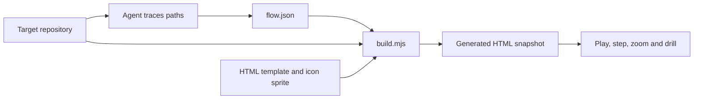

# Flow-map build and browser boundaries

Status: Current implementation
Updated: 2026-10-03

## Overview

The agent traces a target repository and writes a `flow.json` model. The Node builder
validates that model, reads the referenced source excerpts and embeds the result into
one HTML file. The browser plays and explores that snapshot.

## Contract and ownership

- The agent owns the trace, descriptions, selected excerpts and reviewed issues.
- [The schema](../../skills/flow-map/references/schema.md) owns the model vocabulary.
- The builder validates node/edge references, file existence, root containment,
  line bounds and the maximum 40-line excerpt length.
- Source excerpts are read at build time and common secret patterns are redacted.
  That pattern-based redaction is not a guarantee that all sensitive content is removed.
- The template owns navigation, playback and the source/state/issue panel.
- Excerpts are snapshots. After source changes, update the model's paths, ranges and
  explanation, then rebuild; an existing HTML file does not watch the repository.

## Browser boundary

The current template does not send questions to Codex, read arbitrary local source
files or launch shell commands. It includes Google Fonts stylesheets, while its map
data, application JavaScript and icons are embedded in the generated artifact.

Connecting a question box to Codex requires additional runtime integration. The
[Codex questions plan](../planning/flow-map-codex-questions-plan.md) describes that
future work; its session-routing behavior is not part of today's contract.

## Key files

| File | Responsibility |
| --- | --- |
| [SKILL.md](../../skills/flow-map/SKILL.md) | Trace, model, review and delivery workflow |
| [build.mjs](../../skills/flow-map/scripts/build.mjs) | Validation, excerpt loading and HTML generation |
| [template.html](../../skills/flow-map/assets/template.html) | Browser presentation and interaction |
| [schema.md](../../skills/flow-map/references/schema.md) | Authoring contract |
| [example.flow.json](../../skills/flow-map/assets/example.flow.json) | Runnable builder example |
