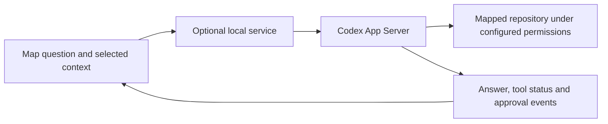

# Ask Codex from a flow map

Status: Proposed; implementation has not started
Updated: 2026-10-03
Backlog: CV-001, CV-002, CV-003 in [the backlog](../backlog.jsonld)

## Outcome

A reader selects a diagram node, step or issue and asks a question in the generated
HTML. Codex receives the question with that context, can inspect the mapped repository
under its configured permissions, and streams the answer back into the map.

The motivating request is to continue discussing the code directly beside its diagram,
with either a dedicated conversation or an explicitly selected existing Codex thread.

## Current behavior and evidence

The [current architecture](../architecture/flow-map-build.md) produces an HTML snapshot
with embedded excerpts. It has no chat transport or local-machine bridge.

Official [Codex App Server documentation](https://learn.chatgpt.com/docs/app-server)
describes `thread/start`, `thread/resume`, `turn/start`, `turn/steer`, streamed events
and approval requests. The installed CLI inspected on 2026-10-03 exposes `app-server`
with stdio, Unix socket and WebSocket transport options. The documentation labels
the WebSocket transport experimental and unsupported.

These capabilities support a proposed integration, but do not prove that an arbitrary
currently open Codex/ChatGPT host conversation is reachable from another process.
Thread ID, owning runtime, storage, authentication and active-turn behavior need an
actual compatibility check in CV-001. Do not claim current-session delivery from a
successful new-thread test.

## Proposed connection

Prefer a local service using App Server's documented stdio protocol for the first
prototype. The service handles process lifecycle, authentication, thread selection,
request correlation and events; the HTML owns the question UI. CV-001 determines the
actual transport and whether an existing host runtime can be accessed safely.

Serve the optional connected UI from a loopback origin. Authenticate its requests and
validate origins; keep credentials out of generated HTML and repositories. Keep the
standalone viewer usable when the service is absent. Source paths sent from the map
are references, not permission to execute a browser-supplied shell command.

## Context and conversation behavior

- Include the explicit question, map identity, selected view/node/step/issue, relevant
  project-relative paths and ranges, and the displayed explanation or redacted excerpt.
- Show which repository and conversation will receive the question before submission.
  Keep submission explicit; navigating a map must not start model work.
- Indicate that embedded excerpts may be stale; Codex can re-read referenced source
  within the selected workspace. Do not silently replace the diagram with an answer.
- Start with a persistent dedicated map conversation, preserving follow-up context and
  the thread ID across service/page restarts where supported.
- Add existing-thread routing only after verifying the owning runtime and permissions.
  Handle busy turns explicitly using supported steering/queuing behavior; never report
  a new thread or fork as delivery to the selected original conversation.
- Render answer deltas, completion, interruption, tool status and failures distinctly.
  Forward approval requests for an explicit user response; never auto-approve them.
- Retain the configured workspace and sandbox policies. Explanation-only behavior is
  the initial use case; code-editing actions require their own user instruction.

## Delivery sequence

1. [CV-001: connection spike](tasks/001-codex-connection-spike.md): verify local APIs,
   authentication, events, approvals, process cleanup and thread ownership.
2. [CV-002: contextual questions](tasks/002-contextual-codex-questions.md): dedicated
   conversation, node-aware question UI, follow-ups and recoverable failure states.
3. [CV-003: existing threads](tasks/003-existing-thread-routing.md): explicit destination
   selection and proven same-thread delivery, or a clear unsupported state.

## Acceptance and open decisions

For the first release, a question about a selected node reaches a dedicated thread
with the correct context, streams back into the HTML, and supports a follow-up after
reload. Disconnected, denied, interrupted and failed runs must be distinguishable.
The standalone example must still build and play without the local service.

CV-001 must settle process ownership and cleanup, credential source, workspace binding,
thread persistence, minimum compatible CLI version and the approval/event contract.
CV-003 must verify whether the user's active host conversation is accessible; otherwise
offer a clearly labeled dedicated conversation without claiming session continuity.

No runtime service, chat UI or session attachment is implemented by this planning work.
